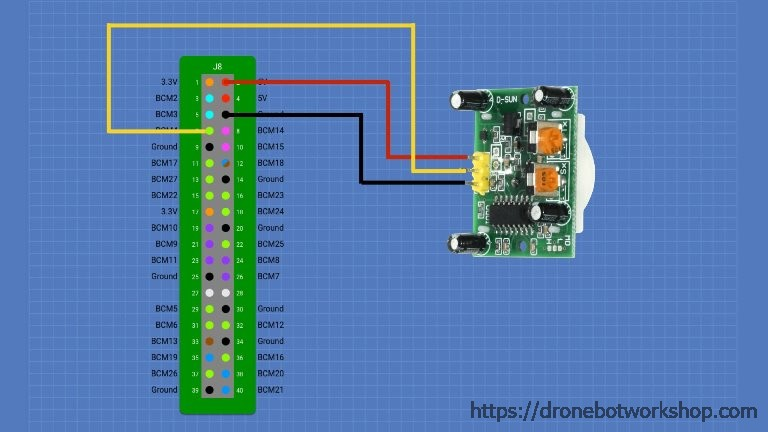

# Passive Infrared Motion Sensor (PIR) - HC-SR501

## Schema

## Node.js

`npm install`

`node pir.js`

## Resources
* https://www.w3schools.com/nodejs/nodejs_raspberrypi_gpio_intro.asp
* https://navody.arduino-shop.cz/navody-k-produktum/pohybove-cidlo-hc-sr501.html